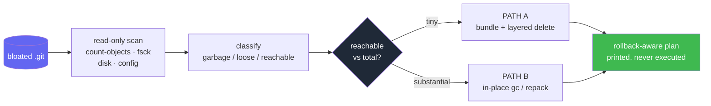

<div align="center">


<p align="center">English | <a href="README.zh-CN.md">简体中文</a></p>

<a href="LICENSE"></a>


<br/>

<a href="https://github.com/LaughingisLaughing/git-repo-doctor">
  
</a>

</div>

---

## 🧭 The problem

When a `.git` directory balloons to tens of gigabytes, the scary part is not running `git gc`. It is deciding **what is safe to delete** without losing real history, especially when the disk is nearly full and one wrong `rm -rf` is irreversible.

Here is a real repo this tool diagnosed: 101 GiB on disk, but the actual history was under 1 GiB.

```text
definite garbage (tmp_*)   :    31.46 GiB   (71 files)  -> 100% safe to delete
loose objects              :    50.26 GiB   (223851 objects)
packs                      :    19.68 GiB   (11 objects in 6 packs)
reachable (real history)   :   859.23 MiB   (0.8% of total)
-> PATH A: bundle the <1GB of real history, verify, then layered delete
```

Git repo bloat is a well-known problem with mature low-level tools (`git gc`, `git prune`, `git repack`, `git-sizer`, `git-filter-repo`, BFG). What is missing is the **diagnosis and decision layer**: given one specific bloated repo, which tool do you reach for, in what order, and how do you avoid losing data? `git-repo-doctor` encodes that judgment into a single read-only command.

## ✨ How it works

It inspects the repo **read-only**, classifies every gigabyte, and prints a cleanup plan tailored to your situation. It never runs a destructive command itself.

- **Read-only and safe.** Runs only `git` queries and filesystem stats. Prints every destructive command as text and executes none.
- **Clear size breakdown.** Definite garbage, loose objects, packs, reachable history, an unreachable estimate, and disk headroom.
- **Health checks.** `gc.auto=0`, stale `gc.log`, worktree equal to `$HOME`, Syncthing syncing a `.git`, loose-object flood, leftover temp files.
- **Decision engine.** Picks PATH A (bundle + layered delete) or PATH B (in-place gc/repack), and flags giant blobs that need `git-filter-repo` or BFG.
- **Rollback-aware plan.** Bundle safety net, restore verification, layered deletion, explicit rollback points at every step.
- **Agent-friendly.** `--json` for machine consumption, and ships as a Claude Code skill via `SKILL.md`.



## 🚀 Quick start

Zero dependencies. Pure Python 3 standard library plus the `git` CLI. Works on macOS and Linux.

```bash
git clone https://github.com/LaughingisLaughing/git-repo-doctor.git
python3 git-repo-doctor/scripts/git_repo_doctor.py --git-dir /path/to/bloated/.git
```

## 🩺 What it reports

1. **Size breakdown** so you can see what is garbage versus reclaimable versus real history.
2. **Health issues** that explain why the repo bloated and how to stop it recurring.
3. **A recommendation** with a ready-to-paste, rollback-aware cleanup plan.

See [`examples/sample-report.md`](examples/sample-report.md) for the full output of the 101 GiB case above.

## 🧠 How it decides

| reachable vs total | recommendation |
| --- | --- |
| < 1 GiB and < 10% of total | **PATH A**: bundle safety net, then layered delete / rebuild |
| substantial, free space ample | **PATH B**: `git maintenance` + `gc` / `repack` in place |
| substantial, disk tight | delete garbage first to free headroom, then repack |
| few packed objects but a huge pack | giant-blob hint: run `git-sizer`, consider `git-filter-repo` |

## 🛡️ The safe cleanup model

The generated plan favors **layered, reversible** steps over one irreversible `rm -rf`:

1. **Safety net first.** Bundle all reachable refs (usually under 1 GiB even for a 100 GiB repo), then prove it restores with `git bundle verify`, a trial `git clone`, and `git fsck --full`.
2. **Delete proven garbage.** `tmp_pack_*` and `tmp_obj_*` are interrupted-operation leftovers and are always safe to remove. Frees space immediately, and is re-entrant.
3. **Prune unreachable loose objects.** The dangling bulk. Everything pruned is still in the verified bundle, and the step is idempotent.
4. **Delayed final delete.** What remains is the core packs, a second on-disk copy of data you already bundled. Keep them a few days as a live safety net, then remove.
5. **Fix the root cause.** Re-enable maintenance (`git maintenance start`), and stop whatever created the bloat (a `$HOME` worktree, `gc.auto=0`, or Syncthing on a `.git`).

Every phase prints a rollback point. Nothing runs automatically.

## 🔒 Safety contract

This tool never runs `gc`, `prune`, `repack`, `rm`, `reflog expire`, or any mutating command. The only things it executes are read-only `git` queries and filesystem stats, all timeout-guarded so they stay responsive even on a 100 GiB repo. Every destructive action exists solely as text in the printed plan for a human to review.

## 📋 CLI reference

<details>
<summary>All flags and invocation modes</summary>

```bash
python3 scripts/git_repo_doctor.py [PATH]        # diagnose the repo containing PATH (default: .)
python3 scripts/git_repo_doctor.py --git-dir DIR # target a specific or renamed / disabled .git
python3 scripts/git_repo_doctor.py --json        # machine-readable output, for tooling / agents
python3 scripts/git_repo_doctor.py --no-remote   # skip the network remote reachability probe
```

Use it as a Claude Code / agent skill by symlinking the repo into your skills directory; the agent reads `SKILL.md` and runs the script when it detects a bloated repo:

```bash
ln -s "$PWD/git-repo-doctor" ~/.claude/skills/git-repo-doctor
```

</details>

## ⚠️ Limitations

<details>
<summary>Known caveats and roadmap</summary>

- The unreachable figure is an order-of-magnitude estimate (loose objects are uncompressed, reachable size is the packed view). It is meant for decisions, not accounting.
- The giant-blob check is a heuristic hint; it does not run `git-sizer` for you.
- Roadmap: optional `git-sizer` integration, a multi-repo scan mode to catch bloat early across many projects, and a `--plan-only` mode.

</details>

## 🤝 Contributing

Issues and pull requests are welcome. The script is intentionally a single dependency-free file so it stays easy to audit and drop into any environment. Please keep it read-only by default: destructive operations should only ever be emitted as text in the plan.

## 🙏 Acknowledgements

The decision model was distilled from a multi-model investigation (web research plus Grok, GPT, and DeepSeek) of a real 101 GiB home-directory repository that crashed a coding agent during scanning.

<div align="center">

**MIT** © [LaughingisLaughing](https://github.com/LaughingisLaughing)

</div>
