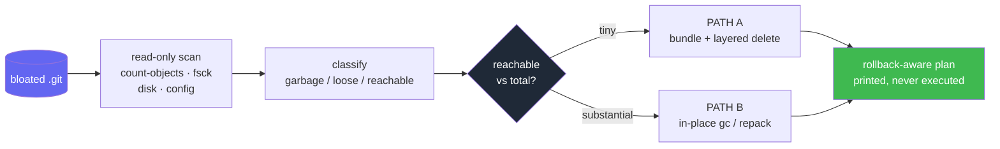

<div align="center">



<p align="center"><a href="README.md">English</a> | 简体中文</p>

<a href="LICENSE"></a>


<br/>

<a href="https://github.com/LaughingisLaughing/git-repo-doctor">
  
</a>

</div>

---

## 🧭 问题

当一个 `.git` 目录膨胀到几十 GB，真正棘手的不是跑 `git gc`，而是判断「哪些能安全删掉」却不丢真实历史，尤其在硬盘快满、一个手滑的 `rm -rf` 就不可逆的时候。

下面是这个工具诊断过的真实仓库：磁盘占用 101 GiB，但真实历史不到 1 GiB。

```text
definite garbage (tmp_*)   :    31.46 GiB   (71 files)  -> 100% safe to delete
loose objects              :    50.26 GiB   (223851 objects)
packs                      :    19.68 GiB   (11 objects in 6 packs)
reachable (real history)   :   859.23 MiB   (0.8% of total)
-> PATH A: bundle the <1GB of real history, verify, then layered delete
```

Git 仓库膨胀是个广为人知的问题，底层工具也很成熟（`git gc`、`git prune`、`git repack`、`git-sizer`、`git-filter-repo`、BFG）。缺的是「诊断与决策」这一层：面对一个具体的膨胀仓库，该用哪个工具、按什么顺序、怎么不丢数据？`git-repo-doctor` 把这套判断固化成一条只读命令。

## ✨ 工作原理

它以只读方式检查仓库，把每一 GB 归类，再输出一份贴合你处境的清理方案，自己绝不执行任何破坏性命令。

- **只读且安全。** 只跑 `git` 查询和文件系统统计。所有破坏性命令都以文本形式打印，一条都不执行。
- **清晰的体积拆分。** 铁垃圾、松散对象、pack、可达历史、不可达估算，以及磁盘余量。
- **健康检查。** `gc.auto=0`、残留的 `gc.log`、worktree 等于 `$HOME`、Syncthing 同步 `.git`、松散对象泛滥、残留临时文件。
- **决策引擎。** 在 PATH A（bundle + 分层删除）和 PATH B（原地 gc/repack）之间选路，并标记需要 `git-filter-repo` 或 BFG 处理的巨型 blob。
- **可回滚方案。** bundle 安全网、恢复验证、分层删除，每一步都标注回滚点。
- **对 agent 友好。** `--json` 供程序消费，并通过 `SKILL.md` 作为 Claude Code skill 分发。



## 🚀 快速开始

零依赖。纯 Python 3 标准库加 `git` 命令行。支持 macOS 和 Linux。

```bash
git clone https://github.com/LaughingisLaughing/git-repo-doctor.git
python3 git-repo-doctor/scripts/git_repo_doctor.py --git-dir /path/to/bloated/.git
```

## 🩺 它报告什么

1. **体积拆分**，让你一眼看清哪些是垃圾、哪些可回收、哪些是真实历史。
2. **健康问题**，解释仓库为什么会膨胀、以及如何防止复发。
3. **一份建议**，附带可直接粘贴、带回滚点的清理方案。

完整输出见 [`examples/sample-report.md`](examples/sample-report.md)，即上面那个 101 GiB 案例。

## 🧠 它如何决策

| 可达 vs 总量 | 建议 |
| --- | --- |
| < 1 GiB 且占比 < 10% | **PATH A**：bundle 安全网，再分层删除或重建 |
| 历史可观，空间充裕 | **PATH B**：原地 `git maintenance` + `gc` / `repack` |
| 历史可观，磁盘紧张 | 先删垃圾腾出空间，再 repack |
| pack 里对象很少却很大 | 巨型 blob 提示：跑 `git-sizer`，考虑 `git-filter-repo` |

## 🛡️ 安全清理模型

生成的方案偏向「分层、可回滚」的步骤，而不是一次不可逆的 `rm -rf`：

1. **先建安全网。** 把所有可达 ref 打成 bundle（哪怕 100 GiB 的仓库通常也不到 1 GiB），再用 `git bundle verify`、试 `git clone`、`git fsck --full` 证明它能恢复。
2. **先删铁垃圾。** `tmp_pack_*` 和 `tmp_obj_*` 是中断操作留下的残骸，删除永远安全。能立即释放空间，且可重入。
3. **prune 不可达松散对象。** 悬挂的大头。删掉的都还在验证过的 bundle 里，这一步幂等。
4. **延迟最终删除。** 剩下的是核心 pack，是你已打进 bundle 的数据的第二份磁盘副本。留几天当活的安全网，再删。
5. **修根因。** 重新开启维护（`git maintenance start`），并停掉造成膨胀的源头（worktree 是 `$HOME`、`gc.auto=0`、或 Syncthing 同步 `.git`）。

每个阶段都会打印回滚点。没有任何一步自动执行。

## 🔒 安全契约

这个工具从不运行 `gc`、`prune`、`repack`、`rm`、`reflog expire` 或任何会改动数据的命令。它执行的只有只读的 `git` 查询和文件系统统计，而且全部带超时保护，哪怕在 100 GiB 的仓库上也能保持响应。所有破坏性动作都只作为文本出现在打印的方案里，交给人来审阅。

## 📋 命令行参考

<details>
<summary>全部参数与调用方式</summary>

```bash
python3 scripts/git_repo_doctor.py [PATH]        # diagnose the repo containing PATH (default: .)
python3 scripts/git_repo_doctor.py --git-dir DIR # target a specific or renamed / disabled .git
python3 scripts/git_repo_doctor.py --json        # machine-readable output, for tooling / agents
python3 scripts/git_repo_doctor.py --no-remote   # skip the network remote reachability probe
```

把仓库 symlink 进你的 skills 目录，即可作为 Claude Code / agent skill 使用；agent 读取 `SKILL.md`，在发现膨胀仓库时运行脚本：

```bash
ln -s "$PWD/git-repo-doctor" ~/.claude/skills/git-repo-doctor
```

</details>

## ⚠️ 局限

<details>
<summary>已知注意事项与路线图</summary>

- 不可达体积是数量级估算（松散对象未压缩，可达体积是压缩后的 pack 视角）。它用于决策，不用于精确记账。
- 巨型 blob 检查是启发式提示，它不会替你跑 `git-sizer`。
- 路线图：可选的 `git-sizer` 集成、跨多个项目尽早发现膨胀的多仓库扫描模式，以及 `--plan-only` 模式。

</details>

## 🤝 参与贡献

欢迎提 issue 和 PR。脚本刻意保持为单个零依赖文件，这样易于审计、能随手丢进任何环境。请保持它默认只读：破坏性操作只能作为方案里的文本输出。

## 🙏 致谢

这套决策模型，提炼自一次多模型联合排查（网络检索加上 Grok、GPT、DeepSeek），对象是一个真实的 101 GiB 家目录仓库，它在被一个编码 agent 扫描时把进程撑崩了。

<div align="center">

**MIT** © [LaughingisLaughing](https://github.com/LaughingisLaughing)

</div>
